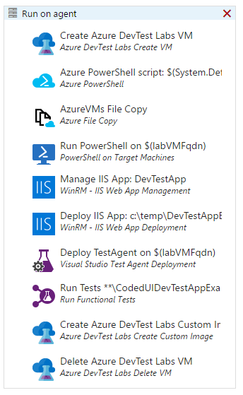
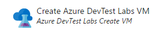
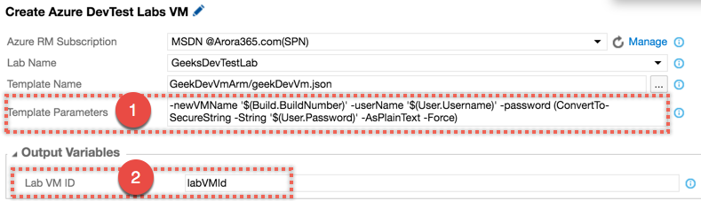
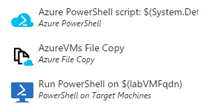
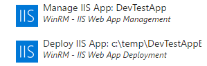
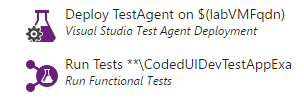
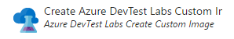
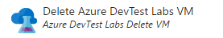

# DevTest Labs Azure | PoC End-to-End
A solução foi desenhada para um cenário onde é possível criar uma vm, realizar o deploy do seu release e executar testes de interface. Alguns dos grandes benefícios são notados na facilidade de provisionamento e economia no uso dos recursos do Azure.

O cenário segue a seguinte estrutura de configuração. O restante do documento apresenta os detalhes de cada passo listado aqui.

[Ambiente](#ambiente)
  * [Instalar a Extensão](#instalar-a-extensão)
  * [Configurar o Endpoint](#configurar-o-endpoint)
  
[Solução](#solução)
  * [Criar Lab no Azure DevTest Labs](#criar-lab-no-azure-devtest-labs)
  * [Criar ARM Template](#criar-arm-template)
  * [Configurar WinRM no ARM Template](#configurar-winrm-no-arm-template)
  * [Criar arquivo de coleta de variáveis para deploy](#criar-arquivo-de-coleta-de-variáveis-para-deploy)
  
[Deploy (tasks)](#deploy-tasks)
  * [Criar VM](#criar-vm)
  * [Configurar VM](#configurar-vm)
  * [Implantar Aplicação](#implantar-aplicação)
  * [Rodar Testes CodedUI](#rodar-testes-codedui)
  * [Criar Imagem](#criar-imagem)
  * [Excluir VM](#excluir-vm)

## Ambiente
### Instalar a Extensão
Inicie instalando a extensão [Azure DevTest Labs Tasks](https://marketplace.visualstudio.com/items?itemName=ms-azuredevtestlabs.tasks):
  - Para Team Services, escolha *Install*.
  - Para Team Foundation Server, escolha *Download* e instale a extensão no seu servidor.

E depois instale a extensão [IIS Web App Deployment Using WinRM](https://marketplace.visualstudio.com/items?itemName=ms-vscs-rm.iiswebapp)
  - Para Team Services, escolha *Install*.
  - Para Team Foundation Server, escolha *Download* e instale a extensão no seu servidor.

### Configurar o Endpoint
Siga esses passos para estabelecer uma conexão do Team Foundation Server com o Azure.
É necessária uma Azure subscription para completar esses passos.
  1. Abra o seu projeto do TFS no browser. Escolha o ícone *Settings* na barra de menu e selecione *Services*.
  2. Na aba Services, escolha *New Service Endpoint* e selecione *Azure Resource Manager*.
  3. Entre com um nome amigável para a conexão e selecione sua Azure subscription.

## Solução
### Criar Lab no Azure DevTest Labs
Os seguintes passos ilustram como utilizar o [Portal Azure](http://portal.azure.com) para criar um lab no Azure DevTest Labs.
  1. Entre no **[Portal Azure](http://portal.azure.com)**.
  2. Selecione **More services**, e então selecione **DevTest Labs** na lista.
  3. Na página **DevTest Labs**, clique em **Add**.
  4. Na página **Create a DevTest Lab**, selecione as especificações e configurações necessárias para criar o lab e clique em **Create**.
	
### Criar ARM Template
Execute essas tarefas para criar o template do Azure Resource Manager (ARM) que será usado para criar uma Azure Virtual Machine sob demanda.
  1. Entre no [Portal Azure](http://portal.azure.com).
  2. Selecione **More Services**, e então selecione **DevTest Labs** na lista.
  3. A partir da lista de labs, selecione o lab que se deseja criar a VM.
  4. Na página Overview do lab, selecione **+ Virtual Machine**.
  5. Na página **Choose a base**, selecione uma base para a VM.
  6. Na página **Virtual machine**, entre com o nome da nova virtual machine no text box **Virtual machine name**.
  7. Selecione as especificações e configurações necessárias para criar a VM
  8. Clique em **View ARM template** para visualizar o template.
  9. Na página **View Azure Resource Manager Template**, selecione o texto do template.
  10. Copie o texto selecionado para a área de tranferência (Ctrl + C).
  11. Selecione **OK** para fechar a página **View Azure Resource Manager Template**.
  12. Abra um editor de texto.
  13. Cole o template da área de tranferencia (Ctrl + V).
  14. Salve o ARM template como um arquivo no seu computador. 
  15. Nomeie o arquivo como **CreateVMTemplate.json**.

### Configurar WinRM no ARM Template
O acesso via WinRM é necessário para usar tarefas de deploy como *Azure File Copy* e *PowerShell on Target Machines*.
  1. Na seção **_parameters_** do ARM template (**CreateVMTemplate.json**) inclua três parâmetros:
    - **Run_Powershell.scriptFileUris**: Links para os scripts de configuração do WinRM.
    - **Run_Powershell.scriptToRun**: Nome do script que será executado (ponto de entrada).
    - **Run_PowerShell.scriptArguments**: Variável para especificar o hostName da VM. O host name especificado aqui é usado para criar um certificado self-signed local para Https. Esse parâmetro será traduzido para  `*.brasilsouth.cloudapp.azure.com`. É possível escolher uma convenção diferente se a VM participar de um domínio ou possui um formato FQDN diferente.

    ```json
          "Run_PowerShell.scriptFileUris": {
          "type": "string",
          "defaultValue": "[[\"https://raw.githubusercontent.com
                                    /Azure/azure-quickstart-templates
                                    /master/201-vm-winrm-windows
                                    /ConfigureWinRM.ps1\", 
                            \"https://raw.githubusercontent.com
                                    /Azure/azure-quickstart-templates
                                    /master/201-vm-winrm-windows
                                    /makecert.exe\", 
                            \"https://raw.githubusercontent.com
                                    /Azure/azure-quickstart-templates
                                    /master/201-vm-winrm-windows
                                    /winrmconf.cmd\"]"
        },
        "Run_PowerShell.scriptToRun": {
          "type": "string",
          "defaultValue": "ConfigureWinRM.ps1"
        },
        "Run_PowerShell.scriptArguments": {
          "type": "string",
          "defaultValue": "[concat('*.',resourceGroup().location,'.cloudapp.azure.com')]"
        }
    ```
  2. Na seção **_artifact_** do ARM template utilize o artefato powershell para realizar uma chamada para seu script powershell passando os parâmetros requeridos pelo script.
   
   ```json
    "artifacts": 
            [
              {
                "artifactId": 
                    "[resourceId('Microsoft.DevTestLab/labs/artifactSources/artifacts', 
                            parameters('labName'), 'Public Repo', 
                                    'windows-run-powershell')]",
                "parameters": [
                  {
                    "name": "scriptFileUris",
                    "value": "[parameters('Run_PowerShell.scriptFileUris')]"
                  },
                  {
                    "name": "scriptToRun",
                    "value": "[parameters('Run_PowerShell.scriptToRun')]"
                  },
                  {
                    "name": "scriptArguments",
                    "value": "[parameters('Run_PowerShell.scriptArguments')]"
                  }
                ]
              }
            ]
    ```
  3. Salve as mudanças no template. O template agora está pronto para configurar o WinRM automaticamente.
  4. Realize o commit do template no seu sistema de controle de fontes.
  
### Criar arquivo de coleta de variáveis para deploy
Esse script, quando roda no agente como parte do release definition, coleta os valores que serão necessários para o deploy da aplicação se tarefas como **Azure File Copy** ou **PowerShell on Target Machines** são utilizadas. Essas tarefas são normalmente utilizadas para deploy de aplicações para um uma VM Azure, e elas precisam de valores como VM Resource Group name, IP address, e fully-qualified domain name (FDQN).
  1. Abra um editor de texto e copie o seguinte script.
    ```powershell
    Param( [string] $labVmId)

    $labVmComputeId = (Get-AzureRmResource -Id $labVmId).Properties.ComputeId

    # Get lab VM resource group name
     $labVmRgName = (Get-AzureRmResource -Id $labVmComputeId).ResourceGroupName

    # Get the lab VM Name
     $labVmName = (Get-AzureRmResource -Id $labVmId).Name

    # Get lab VM public IP address
     $labVMIpAddress = (Get-AzureRmPublicIpAddress -ResourceGroupName $labVmRgName  Name $labVmName).IpAddress

    # Get lab VM FQDN
     $labVMFqdn = (Get-AzureRmPublicIpAddress -ResourceGroupName $labVmRgName -Name $labVmName).DnsSettings.Fqdn

    # Set a variable labVmRgName to store the lab VM resource group name
     Write-Host "##vso[task.setvariable variable=labVmRgName;]$labVmRgName"

    # Set a variable labVMIpAddress to store the lab VM Ip address
     Write-Host "##vso[task.setvariable variable=labVMIpAddress;]$labVMIpAddress"

    # Set a variable labVMFqdn to store the lab VM FQDN name
     Write-Host "##vso[task.setvariable variable=labVMFqdn;]$labVMFqdn"
    ```
  2. Realize o commit do template no seu sistema de controle de fontes. 
  3. Nomeie o arquivo como GetLabVMParams.ps1.

## Deploy (tasks)
  1. Na definição do release, clique na elipse(...) próxima ao nome do ambiente para abrir o menu de atalho e selecione **Configure variables**. 
  2. Na caixa de diálogo **"Configure - environment"**, entre com os seguintes valores para as variáveis que serão utilizadas nas tarefas do release:
    - User.Name: Entre com o nome do usuário que foi informado quando o ARM template foi criado no Portal Azure.
    - User.Password: Entre com a senha que foi informado quando o ARM template foi criado no Portal Azure. Use o ícone para esconder a senha.
	
O resultado final da definição do release, ficará como a imagem abaixo:



Nas próximas seções será apresentado o  passo a passo para entender o processo de release em detalhe.
### Criar VM



#### Azure DevTest Labs Create VM: 
Clique em **Add build step**, clique na aba **deployment** e selecione **Azure DevTest Lab Create VM**
  - Configure o **Azure DevTest Lab Create VM** selecionando o Endpoint do Azure Resource Manager configurado anteriormente, selecione o nome do dev test lab onde será realizado o deploy e selecione o ARM template.
Abaixo, em destaque, estão os parâmetros do template. Esses campos premitem sobrescrever os parâmetros requeridos pelo ARM template.
    1. Como demonstrado na figura abaixo, foram criadas variáveis de build para User.UserName, User.Password e a variável nativa Build.BuildNumber para o nome da VM.
    2. A variável em Output variable foi criada para armazenar o valor do id da VM que foi criada nesse processo.
    


### Configurar VM



#### Azure Powershell: 
O próximo estágio será executar o script criado anteriormente para coletar os detalhes da DevTest Labs VM. Na release definition, selecione **Add tasks** e adicione uma tarefa **Azure PowerShell** da aba **Deploy**. Configure a tarefa:
  - Selecione Azure Resource Manager para o tipo de conexão.
  - Selecione o endpoint do Azure Resource Manager criado anteriormente.
  - Entre com o caminho completo e o nome do script que foi salvo no repositório de fonte. 
  - Como argumento para o script insira o nome da variável de ambiente que foi automaticamente com o ID da lab VM pela tarefa anterior, por exemplo: -labVmId '$(labVMId)'
  
> O script coleta os valores que serão necessários e os armazena em variáveis de ambiente no release definition para facilmente serem referenciadas nas tarefas subsequentes.

#### Azure File Copy: 
Essa tarefa é utilizada para copiar os arquivos da aplicação e outros artefatos que são necessários para instalar a aplicação na VM Azure. Nesse caso iremos copiar todo o conteúdo do drop para a VM recem criada.
#### Powershell on Target Machines: 
Agora que todos artefatos foram copiados na nova VM provisionada, usaremos a execução remota do Powershell para executar um script DSC.

Esse é um script básico de DSC, ele define a garantia de IIS e ASP.NET no servidor de destino.
```powershell
Configuration iis {
        
        Import-DscResource -ModuleName PSDesiredStateConfiguration;
        
        Node "localhost"{
            
            #Install IIS 
            WindowsFeature IIS {
                Ensure = "Present"
                Name = "Web-Server"
            }
            
            #Install ASP.NET 4.5s
            WindowsFeature ASP {
                Ensure = "Present"
                Name = "Web-Asp-Net45"
            }
        }
    }
iis
Start-DscConfiguration -Path .\iis -Wait -Verbose 
```

### Implantar Aplicação



#### IIS Web App Management using WinRM: 
Essa tarefa habilita a configuração e atualização de app pools e web sites no IIS 
#### IIS Web App Deployment using WinRM: 
Essa tarefa permite informar a localização do pacote do Web Deploy, e instalar a aplicação informando o website.
### Rodar Testes CodedUI



#### Test Agent Deployment: 
Essa tarefa permite a instalação do agente de teste na máquina destino. Esse Agente de Teste pode então ser utilizado para habilitar coleta de dados ou rodar testes distribuidos usando o Visual Studio Test.
#### Run Functional Tests: 
O Projeto possui alguns testes funcionais que serão rodados após o deployment.
### Criar Imagem



#### Azure DevTest Labs Create Custom Image: 
Agora que a aplicação foi instalada e testada, vamos capturar o estado da VM como uma imagem customizada. Isso é especialmente útil se é identificado um bug no processo e é necessário reproduzir o bug na mesma VM, tendo uma imagem customizada da VM irá ajudar na reprodução desse bug mais rapidamente.
### Excluir VM



#### Azure DevTest Labs Delete VM: 
Com a infraestrutura disponibilizada, a aplicação instalada e testada e o estado da VM capturada em uma imagem, parece sensato excluir a VM.

.
.
.

>Referencias:
* https://docs.microsoft.com/en-us/azure/devtest-lab/devtest-lab-create-lab
* https://azure.microsoft.com/en-us/solutions/dev-test/
* http://www.visualstudiogeeks.com/blog/DevOps/Deploy-New-VM-To-Existing-AzureDevTestLab-From-VSTS
* http://www.visualstudiogeeks.com/blog/DevOps/Use-VSTS-ReleaseManagement-to-Deploy-and-Test-in-AzureDevTestLabs
* https://www.visualstudio.com/en-us/docs/release/examples/azure/provision-devtest-lab
